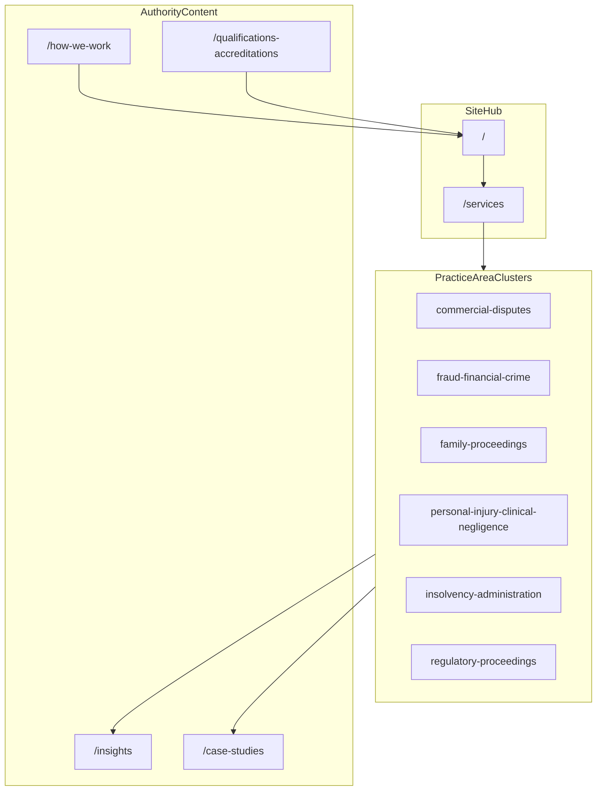
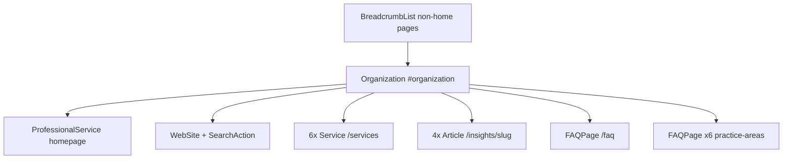

# SEO Architecture — Lawson Forensic

**Domain:** https://www.lawsonforensic.com  
**Last updated:** June 2026  
**Site type:** Branded boutique forensic accounting firm website (not a generic lead-generation directory)

---

## Strategic goals

1. **Branded search dominance** — Rank for “Lawson Forensic” and related branded queries so instructing solicitors and referrers find the official site first.
2. **Authoritative service visibility** — Rank for forensic accounting and expert witness queries where on-site content demonstrates genuine, court-facing expertise.

All SEO decisions must support both goals without compromising brand integrity or the expert’s duty-to-court positioning.

---

## 1. Keyword strategy

Keywords are organised in three tiers. Lawson Forensic does not chase volume for its own sake; each target keyword must map to a page that can answer the query authoritatively.

### Tier 1 — Branded

| Keyword |
| --- |
| Lawson Forensic |
| Lawson Forensic expert witness |
| Lawson Forensic forensic accountant |
| Lawson Forensic forensic accounting |
| lawsonforensic.com |

### Tier 1 — Service (transactional)

| Keyword |
| --- |
| forensic accountant expert witness UK |
| forensic accounting expert witness UK |
| boutique forensic accounting UK |
| forensic accountant SJE UK |
| forensic accountant litigation support UK |
| independent forensic accountant UK |

### Tier 2 — Service (informational)

| Keyword |
| --- |
| how to instruct forensic accountant expert witness |
| forensic accountant CPR Part 35 UK |
| single joint expert forensic accountant UK |
| forensic accountant family proceedings UK |
| POCA expert witness forensic accountant UK |
| forensic accountant commercial dispute UK |

### Tier 3 — Practice area specific

| Keyword |
| --- |
| forensic accountant shareholder dispute UK |
| forensic accountant divorce valuation UK |
| forensic accountant fraud investigation UK |
| forensic accountant personal injury loss earnings UK |
| forensic accountant insolvency expert UK |
| forensic accountant regulatory proceedings UK |

### Keyword-to-URL mapping

| Tier | Example keywords | Primary URL(s) | Secondary URLs |
| --- | --- | --- | --- |
| Branded | Lawson Forensic, lawsonforensic.com | `/` | All pages (title suffix ` \| Lawson Forensic`) |
| Service (transactional) | forensic accountant expert witness UK, SJE UK, litigation support UK | `/services/expert-witness`, `/services` | `/practice-areas/[slug]`, `/contact` |
| Service (informational) | CPR Part 35, instruct forensic accountant, choosing SJE | `/insights/[slug]`, `/faq`, `/how-we-work` | `/services/expert-witness` |
| Practice area | shareholder dispute, divorce valuation, POCA | `/practice-areas/[slug]` | Related `/insights/[slug]`, `/case-studies` |

### Practice area slugs

Defined in `lib/data/practice-areas.ts`:

| Slug | Title | Tier 3 keyword focus |
| --- | --- | --- |
| `commercial-disputes` | Commercial Disputes | forensic accountant commercial dispute UK; shareholder dispute |
| `fraud-financial-crime` | Fraud & Financial Crime | fraud investigation; POCA expert witness |
| `family-proceedings` | Family Proceedings | forensic accountant family proceedings UK; divorce valuation |
| `personal-injury-clinical-negligence` | Personal Injury & Clinical Negligence | loss of earnings expert |
| `insolvency-administration` | Insolvency & Administration | insolvency expert |
| `regulatory-proceedings` | Regulatory Proceedings | regulatory proceedings expert |

### Insights article slugs (launch)

Defined in `lib/data/insights.ts`:

| Article title | Slug | Primary Tier 2 keywords |
| --- | --- | --- |
| Instructing a Forensic Accountant | `instructing-forensic-accountant-guide` | how to instruct forensic accountant expert witness |
| Business Valuation in Divorce | `business-valuation-divorce-guide` | forensic accountant divorce valuation UK |
| POCA Benefit Calculations | `poca-benefit-calculation-guide` | POCA expert witness forensic accountant UK |
| Choosing an SJE | `choosing-single-joint-expert` | single joint expert forensic accountant UK |

---

## 2. Content strategy — branded site approach

Unlike generic keyword sites, lawsonforensic.com builds authority through depth, specificity, and verifiable expertise—not thin service pages or location spam.

### Four authority pillars

| Pillar | Route | Purpose | Data source |
| --- | --- | --- | --- |
| Thought leadership | `/insights` | Quarterly articles targeting informational Tier 2 keywords | `lib/data/insights.ts` |
| Case study narratives | `/case-studies` | Proof of court-facing work (most competitors have none) | `lib/data/case-studies.ts` |
| Transparent process | `/how-we-work` | Trust and conversion support for solicitor referrals | Page content (TBD) |
| Credentials depth | `/qualifications-accreditations` | Verifiable, specific accreditations | Page content (TBD) |

### Content clusters

Clusters are organised around **practice areas**, not isolated keyword themes. Each practice area page links to relevant insights, case studies, and services.



### Publishing cadence

- **Minimum:** 4 insights articles per year at launch (quarterly).
- **Target:** 8 insights articles per year once established.
- **Case studies:** Add narrative case studies as matters permit (anonymised); no minimum frequency, but quality over quantity.

### Planned route map

| # | Route | File (App Router) | Index? |
| --- | --- | --- | --- |
| 1 | `/` | `app/page.tsx` | Yes |
| 2 | `/about` | `app/about/page.tsx` | Yes |
| 3 | `/services` | `app/services/page.tsx` | Yes |
| 4 | `/services/[slug]` | `app/services/[slug]/page.tsx` | Yes (×6) |
| 5 | `/practice-areas` | `app/practice-areas/page.tsx` | Yes |
| 6 | `/practice-areas/[slug]` | `app/practice-areas/[slug]/page.tsx` | Yes (×6) |
| 7 | `/case-studies` | `app/case-studies/page.tsx` | Yes |
| 8 | `/qualifications-accreditations` | `app/qualifications-accreditations/page.tsx` | Yes |
| 9 | `/how-we-work` | `app/how-we-work/page.tsx` | Yes |
| 10 | `/faq` | `app/faq/page.tsx` | Yes |
| 11 | `/insights` | `app/insights/page.tsx` | Yes |
| 12 | `/insights/[slug]` | `app/insights/[slug]/page.tsx` | Yes (×4 at launch) |
| 13 | `/contact` | `app/contact/page.tsx` | Yes (sitemap; form converts) |
| — | `/expert-witness`, `/investigations`, `/fees` | Redirects | 301 to services/contact |
| 16 | `/thank-you` | `app/thank-you/page.tsx` | **No** (`noindex`) |
| 17 | 404 | `app/not-found.tsx` | N/A |
| 18 | `/privacy` | `app/privacy/page.tsx` | **No** (`noindex`) |
| 19 | `/terms` | `app/terms/page.tsx` | **No** (`noindex`) |

---

## 3. Entity optimisation

Google’s Knowledge Graph and local entity signals depend on consistent identity across the web. The canonical entity name is **Lawson Forensic** everywhere.

### Entity name and NAP

| Field | Value |
| --- | --- |
| **Name** | Lawson Forensic |
| **Website** | https://www.lawsonforensic.com |
| **Email** | info@lawsonforensic.com |
| **Phone** | *(Confirm before publishing on GBP and schema)* |
| **Address** | *(Confirm before publishing on GBP and schema; UK national practice)* |

NAP (Name, Address, Phone) must match exactly on: website footer, Google Business Profile, LinkedIn, directory listings, and any schema `PostalAddress` once confirmed.

### sameAs and directory presence

**Current implementation** (`lib/schema.ts`): `sameAs` includes LinkedIn only via `NEXT_PUBLIC_LINKEDIN_URL` (default: `https://www.linkedin.com/company/lawson-forensic`).

**Target sameAs expansion** (add URLs to schema when listings are live):

| Platform | Handle / listing | Action |
| --- | --- | --- |
| LinkedIn company page | lawsonforensic | Create page; link in schema `sameAs` |
| Google Business Profile | Lawson Forensic | Create profile (see Section 6) |
| UK Register of Expert Witnesses | jspubs.com | Submit listing; name: Lawson Forensic |
| Academy of Experts | Member listing | Submit; consistent name |
| Expert Witness Institute (EWI) | Member listing | Submit; consistent name |
| ICAEW | Firm listing | Submit if applicable |
| ACFE UK Chapter | Directory | Optional directory presence |

**Future env pattern:** When multiple directory URLs exist, consider `NEXT_PUBLIC_SAME_AS_URLS` (comma-separated) merged into `sameAs` in `lib/schema.ts`.

### Person schema policy

**Do not add Person schema with placeholder or generic practitioner details.**

On a branded expert witness site, fake or vague Person markup signals low trust. Add Person schema only when:

- Real practitioner name, role, and credentials are confirmed for publication
- A dedicated team or profile page exists with substantive content
- `sameAs` can link to verifiable professional profiles (e.g. LinkedIn individual, ICAEW register)

Until then, use **Organization** as `author` on Article schema (already implemented in `articleSchema()`).

### Off-site entity checklist

- [ ] Create LinkedIn company page: **Lawson Forensic**
- [ ] Create Google Business Profile: **Lawson Forensic**
- [ ] Submit to jspubs.com (UK Register of Expert Witnesses)
- [ ] Submit to Academy of Experts member directory
- [ ] Submit to Expert Witness Institute listing
- [ ] Submit ICAEW firm listing (if applicable)
- [ ] Verify NAP consistency across all platforms

---

## 4. Schema architecture

Structured data reinforces the **Lawson Forensic** entity and connects services, content, and FAQs to that entity.

### Root entity

```json
{
  "@type": "Organization",
  "@id": "https://www.lawsonforensic.com/#organization",
  "name": "Lawson Forensic",
  "url": "https://www.lawsonforensic.com"
}
```

### Schema graph overview



### Children by page type

| Schema type | Where | Notes |
| --- | --- | --- |
| Organization | Homepage `@graph` | Root; `@id` `/#organization` |
| ProfessionalService | Homepage `@graph` | `serviceType`: Forensic Accounting; `hasOfferCatalog` with 6 services |
| WebSite + SearchAction | Homepage `@graph` | Search targets `/insights?q={search_term_string}` |
| Service (×6) | `/services` page + catalog on homepage | IDs: `#expert-witness`, `#fraud-investigation`, etc. |
| Article (×4 at launch) | `/insights/[slug]` | Organization as author |
| FAQPage | `/faq` | `lib/data/faq.ts` → `siteFaqs` |
| FAQPage | `/practice-areas/[slug]` | Per-area `faqs` in `lib/data/practice-areas.ts` |
| BreadcrumbList | All non-homepage pages | `breadcrumbSchema()` |

### Page injection matrix

| Page | JSON-LD types | Helper (`lib/schema.ts`) | Data source |
| --- | --- | --- | --- |
| `/` | Organization, WebSite, SearchAction, ProfessionalService, OfferCatalog | `homepageSchema()` | Inline service definitions in schema file |
| `/services` | 6× Service | `servicesPageSchema()` | Same 6 services as homepage catalog |
| `/insights/[slug]` | Article | `articleSchema(article)` | `lib/data/insights.ts` |
| `/faq` | FAQPage | `faqPageSchema(faqs)` | `lib/data/faq.ts` |
| `/practice-areas/[slug]` | FAQPage | `faqPageSchema(area.faqs)` | `lib/data/practice-areas.ts` |
| All non-home | BreadcrumbList | `breadcrumbSchema(items)` | Per-page breadcrumb trail |

### Six services (schema IDs)

| Service ID | Name |
| --- | --- |
| `expert-witness` | Expert Witness Reports |
| `fraud-investigation` | Fraud Investigation |
| `asset-tracing` | Asset Tracing |
| `business-valuation` | Business Valuation |
| `loss-quantification` | Loss Quantification |
| `family-matrimonial-accounting` | Family & Matrimonial Accounting |

### Implementation status

| Component | Status | Path |
| --- | --- | --- |
| Schema builder functions | **Implemented** | `lib/schema.ts` |
| `jsonLdScript()` serializer | **Implemented** | `lib/schema.ts` |
| React `JsonLd` component | **Implemented** | `components/seo/JsonLd.tsx` |
| Per-page schema injection | **Implemented** | All indexable `app/**/page.tsx` |
| Keyword map | **Implemented** | `lib/seo/keywordMap.ts` |
| Internal linking (Appendix D) | **Implemented** | `lib/seo/internalLinks.ts`, `InternalLinksSection` |
| `sameAs` expansion | **Implemented** | `NEXT_PUBLIC_SAME_AS_URLS` + LinkedIn |

**Required `JsonLd` component pattern:**

```tsx
// components/seo/JsonLd.tsx
import { jsonLdScript } from "@/lib/schema";

export function JsonLd({ data }: { data: object }) {
  return (
    <script
      type="application/ld+json"
      dangerouslySetInnerHTML={jsonLdScript(data)}
    />
  );
}
```

Homepage example:

```tsx
import { homepageSchema } from "@/lib/schema";
import { JsonLd } from "@/components/seo/JsonLd";

export default function HomePage() {
  return (
    <>
      <JsonLd data={homepageSchema()} />
      {/* page content */}
    </>
  );
}
```

---

## 5. Link building strategy

Branded firm sites require a different link profile than keyword directories. Links should reinforce professional credibility and referral trust, not manipulate rankings with irrelevant placements.

### Priority 1 — Professional body listings

| Target | Purpose |
| --- | --- |
| ICAEW member firm listing | Professional credibility signal |
| Academy of Experts member listing | Expert witness directory presence |
| Expert Witness Institute listing | Court-facing specialist recognition |
| UK Register of Expert Witnesses (jspubs.com) | Solicitor search behaviour |
| ACFE UK Chapter directory | Fraud investigation credibility |

### Priority 2 — Resolution / Law Society directories

| Target | Purpose |
| --- | --- |
| Resolution (family law) | Family proceedings referral network |
| Law Society expert finder | Cross-practice solicitor discovery |

### Priority 3 — Thought leadership citation building

Publish `/insights` articles and pitch republication or citation in:

- Family Law Week
- Commercial Dispute Resolution (CDR)
- Fraud Intelligence
- ICAEW *economia*
- Lexology

Each citation should link to the canonical article URL on lawsonforensic.com.

### Priority 4 — Referral network

**Primary lead generation is solicitor referral**, not organic contact forms. The website validates and supports that network:

- Every instructing solicitor is a potential repeat referrer
- Case studies and insights give solicitors material to share internally
- Qualifications and process pages reduce friction for first-time instructions
- Do not compete with referral relationships via aggressive directory SEO

---

## 6. Local SEO

Even for a UK-national practice, a Google Business Profile creates a **local entity signal** and supports branded search disambiguation.

### Google Business Profile specification

| Field | Value |
| --- | --- |
| **Business name** | Lawson Forensic |
| **Category** | Forensic Accountant |
| **Website** | https://www.lawsonforensic.com |
| **Description** | UK boutique forensic accounting practice providing expert witness reports and financial investigation services. |
| **Service area** | United Kingdom (if applicable to profile type) |
| **NAP** | Must match website and directory listings exactly |

### Actions

- [ ] Create and verify Google Business Profile
- [ ] Add website URL and primary category
- [ ] Align NAP with site footer and schema once address/phone confirmed
- [ ] Request reviews only from genuine clients where appropriate (no incentive schemes)

---

## 7. Insights content calendar

Regular publishing signals active expertise and creates new keyword surfaces over time.

### Cadence rules

- **Launch minimum:** 4 articles per year (quarterly)
- **Growth target:** 8 articles per year
- Each article must map to at least one Tier 2 keyword and link to relevant practice area pages

### Q1 2026 (launch) — implemented in `lib/data/insights.ts`

| Article | Slug | Status |
| --- | --- | --- |
| Instructing a Forensic Accountant | `instructing-forensic-accountant-guide` | **Content ready** |
| Business Valuation in Divorce | `business-valuation-divorce-guide` | **Content ready** |
| POCA Benefit Calculations | `poca-benefit-calculation-guide` | **Content ready** |
| Choosing an SJE | `choosing-single-joint-expert` | **Content ready** |

### Q2 2026 — planned

| Article | Suggested slug | Practice area link |
| --- | --- | --- |
| Loss of Profits Claims: Methodology Guide | `loss-of-profits-methodology` | `commercial-disputes` |
| FPR Part 25: What Expert Witnesses Must Address | `fpr-part-25-expert-requirements` | `family-proceedings` |
| Fraud Loss vs POCA Benefit: Key Distinctions | `fraud-loss-vs-poca-benefit` | `fraud-financial-crime` |
| Shareholder Disputes: Fair Value vs Fair Market Value | `shareholder-dispute-fair-value` | `commercial-disputes` |

### Q3 2026 — planned

| Article | Suggested slug | Practice area link |
| --- | --- | --- |
| ERA 2025 and Employment Loss Expert Evidence | `era-2025-employment-loss-evidence` | `personal-injury-clinical-negligence` |
| Audit Negligence: ISA Standards and Expert Witnesses | `audit-negligence-isa-standards` | `commercial-disputes` |
| Completion Accounts: The Agreed Accounting Basis Explained | `completion-accounts-accounting-basis` | `commercial-disputes` |
| Lifestyle Analysis in Financial Remedy: Methodology | `lifestyle-analysis-financial-remedy` | `family-proceedings` |

When Q2/Q3 articles are written, add entries to `lib/data/insights.ts` and include URLs in `app/sitemap.ts`.

---

## 8. Competitive positioning

Lawson Forensic sits in the **premium boutique** segment of the UK forensic accounting market.

### Market context

| Segment | Characteristics | Lawson Forensic contrast |
| --- | --- | --- |
| Big 4 / Top-10 (Grant Thornton, Kroll, FTI) | Higher cost, junior team involvement, less responsive, less boutique | Senior-led throughout; responsive; full-service boutique |
| Solo practitioners (jspubs listings) | Limited scope, variable QC, limited court experience | Full-service scope; court-ready quality; consistent methodology |

### On-site expression

Positioning must be **implicit** on every page:

- Demonstrate senior involvement and methodology in case studies and insights
- Use specific procedural references (CPR Part 35, FPR Part 25, CrPR Part 33, POCA, SJE)
- Avoid generic marketing superlatives (“leading”, “number one”, “best in UK”)
- Never state “premium boutique” explicitly; show it through content depth and precision

---

## 9. Technical SEO and deployment checklist

### Codebase implementation status

| Item | Status | Location |
| --- | --- | --- |
| Next.js 15 project | Implemented | `package.json` |
| Site URL constant | Implemented | `lib/site.ts` |
| Metadata builder (canonical, OG `en_GB`, `x-default`) | Implemented | `lib/metadata.ts` |
| Schema builders + per-page injection | Implemented | `lib/schema.ts`, `components/seo/JsonLd.tsx` |
| Apex → www 301 redirect | Implemented | `middleware.ts` |
| Cookie-consent GA loader | Implemented | `lib/cookies/tracking.ts` |
| Q1 insights content | Implemented | `lib/data/insights.ts` |
| Practice areas + FAQs | Implemented | `lib/data/practice-areas.ts` |
| Case studies content | Implemented | `lib/data/case-studies.ts` |
| `app/` routes and layout | Implemented | `app/` |
| `public/sitemap.xml` + `robots.txt` | Implemented | `scripts/generate-seo.ts`, `lib/seo/publicUrlInventory.ts` |
| `html lang="en-GB"` | Implemented | `app/layout.tsx` |
| hreflang `x-default` | Implemented | `lib/metadata.ts`, `app/layout.tsx` |
| Search verification meta | Implemented | Root layout metadata |
| SEO verify CI | Implemented | `.github/workflows/seo-checks.yml` |

### Hosting and DNS

- [ ] Deploy to **Vercel**
- [ ] DNS: `lawsonforensic.com` → Vercel (apex and www)
- [ ] Ensure production host resolves to `www.lawsonforensic.com` (middleware redirects apex → www with 301)

### Root layout requirements (`app/layout.tsx`)

```tsx
<html lang="en-GB">
```

Metadata alternates (UK-focused branded site; no `en-US` variant):

```tsx
alternates: {
  canonical: SITE_URL,
  languages: {
    "x-default": SITE_URL,
  },
},
```

Search engine verification (from env):

```tsx
verification: {
  google: process.env.GOOGLE_SITE_VERIFICATION,
  other: {
    "msvalidate.01": process.env.BING_SITE_VERIFICATION ?? "",
  },
},
```

### Environment variables

Set in Vercel project settings and local `.env` (see `.env.example`):

| Variable | Required | Purpose | Used in |
| --- | --- | --- | --- |
| `NEXT_PUBLIC_SITE_URL` | Yes | Canonical base URL | `lib/site.ts`, schema, metadata, sitemap |
| Google Sheets (contact form) | Yes | `GOOGLE_*` env vars | `lib/google-sheets.ts`, `app/api/submit-lead` |
| `GOOGLE_SITE_VERIFICATION` | Yes | Google Search Console | Root layout metadata |
| `BING_SITE_VERIFICATION` | Yes | Bing Webmaster Tools | Root layout metadata |
| `NEXT_PUBLIC_GA_MEASUREMENT_ID` | Recommended | Google Analytics 4 | `lib/cookies/tracking.ts` (consent-gated) |
| `NEXT_PUBLIC_LINKEDIN_URL` | Yes | Organization `sameAs` | `lib/site.ts`, `lib/schema.ts` |

Optional analytics (stubs exist in tracking module):

- `NEXT_PUBLIC_GTM_ID`
- `NEXT_PUBLIC_META_PIXEL_ID`
- `NEXT_PUBLIC_LINKEDIN_PARTNER_ID`
- `NEXT_PUBLIC_HOTJAR_ID`

### Sitemap and robots

Generated into **`public/sitemap.xml`** and **`public/robots.txt`** via `npm run seo:generate` from `lib/seo/publicUrlInventory.ts`. See **`docs/SEO.md`**.

**Include:** all routes in `APP_STATIC_PATHS` (home, about, services hub + 6 service pages, practice areas, case studies, qualifications, how-we-work, FAQ, insights, contact).

**Exclude:** `/thank-you`, `/privacy`, `/terms`, `/cookies` (noindex).

### Search Console and analytics launch

- [ ] Set `GOOGLE_SITE_VERIFICATION` and verify in Google Search Console
- [ ] Set `BING_SITE_VERIFICATION` and verify in Bing Webmaster Tools
- [ ] Submit sitemap in both consoles
- [ ] Set `NEXT_PUBLIC_GA_MEASUREMENT_ID` after cookie consent banner is live
- [ ] Confirm GA only fires after consent (`lib/cookies/tracking.ts`)

### Off-site launch (entity)

- [ ] Create LinkedIn company page: Lawson Forensic
- [ ] Create Google Business Profile: Lawson Forensic
- [ ] Submit to jspubs, Academy of Experts, EWI, ICAEW (as applicable)
- [ ] Consistent NAP across all platforms

---

## Appendix A — Title tag patterns

| Page type | Pattern | Example |
| --- | --- | --- |
| Homepage | `Lawson Forensic \| Forensic Accounting & Expert Witness UK` | Branded + service hint |
| Standard inner page | `{Page Title} \| Lawson Forensic` | `Expert Witness \| Lawson Forensic` |
| Practice area | `{Practice Area} \| Lawson Forensic` | `Family Proceedings \| Lawson Forensic` |
| Insight article | `{Article Title} \| Lawson Forensic` | Article H1 as title |
| Thank you / legal | `{Page Title} \| Lawson Forensic` | With `noindex` |

Use `buildMetadata()` from `lib/metadata.ts` on every page.

---

## Appendix B — Meta description guidelines

- **Language:** UK English (`en-GB`)
- **Length:** 150–160 characters where possible
- **Content:** One clear proposition + one differentiator (senior-led, CPR/FPR compliance, SJE availability) where natural
- **Avoid:** Keyword stuffing, superlatives, duplicate descriptions across pages
- **Branded pages:** Include “Lawson Forensic” on homepage and about; service pages may lead with capability

---

## Appendix C — Robots and indexation policy

| Route | `robots` |
| --- | --- |
| All public marketing pages | `index, follow` |
| `/thank-you` | `noindex, follow` |
| `/privacy` | `noindex, follow` |
| `/terms` | `noindex, follow` |

Pass `noindex: true` to `buildMetadata()` for excluded routes.

---

## Appendix D — Internal linking rules

1. **Homepage** → Services, Expert Witness, top practice areas, latest insight, contact.
2. **Practice area pages** → Relevant services (`/expert-witness`, `/investigations`), related insights, case studies, contact.
3. **Insights** → Relevant practice area(s), expert witness page, contact CTA at article end.
4. **Services** → Each service links to `href` in `lib/data/services.ts` (practice area or dedicated page).
5. **FAQ** → Link to practice areas and `/how-we-work` for process detail.
6. **Footer** (sitewide) → Practice areas, insights, qualifications, contact; consistent NAP when confirmed.

Use descriptive anchor text (“Family Proceedings practice area”, “instructing a forensic accountant guide”)—not “click here”.

---

## Appendix E — Follow-on implementation tasks

When building `app/` routes, complete in this order:

1. `components/seo/JsonLd.tsx` + wire schema per page injection matrix
2. `app/layout.tsx` — `lang="en-GB"`, hreflang, verification, default metadata
3. Per-page `buildMetadata()` with unique title/description
4. `app/sitemap.ts` and `app/robots.ts`
5. Breadcrumb component + `breadcrumbSchema()` on all non-home pages
6. Insights index with links to all articles; optional client search for `SearchAction`
7. Expand `sameAs` when directory URLs are confirmed
8. Add Person schema only when practitioner profiles are ready for publication

---

## Document maintenance

Update this document when:

- New insights slugs are added to `lib/data/insights.ts`
- NAP or `sameAs` URLs are confirmed
- Person schema is approved for publication
- New practice areas or services are introduced
- Search Console shows new branded or service query opportunities worth targeting with content
